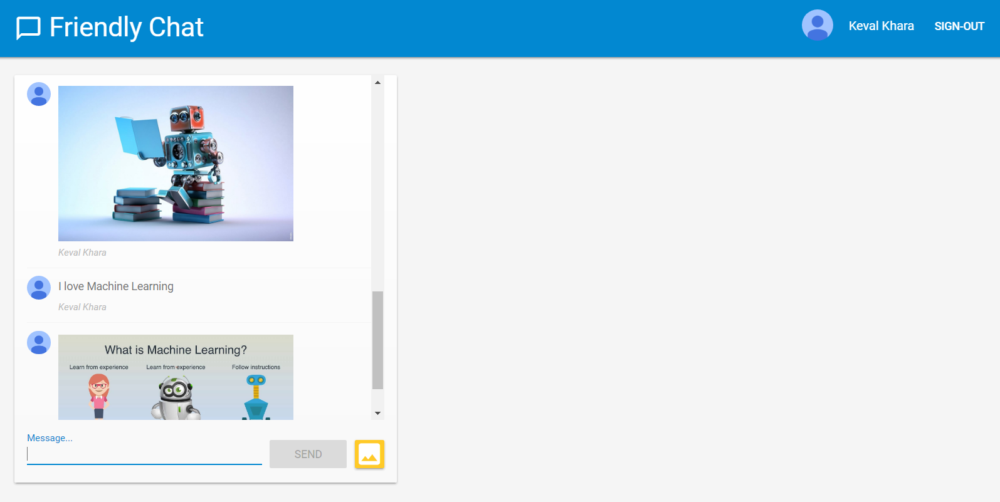

# Web Chatting Application using Firebase

* Simple GUI
* Sign in using Google account
* Ability to send images
* Ability to receive notifications

## Visit the website:
https://friendly-chat-fea3a.firebaseapp.com/

## Screenshot of the application-


## Manual Testing

The test cases carried out manually and their results are in the following excel sheet-


## Automated Testing

The automated tests were carried out using the . The script for automated test on Windows 10 Chrome is given in .

The automated test results were as follows-

```
C:\Users\keval\Desktop>python unittest.py
Loading Url
Maximizing window
Checking title
Done with session 4deaa9fc-4fe7-3217-c29e-5735c3d6a3c7
./anaconda3/lib/python3.6/unittest/suite.py:84: ResourceWarning: unclosed <socket.socket fd=8, family=AddressFamily.AF_INET, type=SocketKind.SOCK_STREAM, proto=6, laddr=('155.41.104.88', 62345), raddr=('104.20.35.153', 443)>
  return self.run(*args, **kwds)

----------------------------------------------------------------------
Ran 1 test in 9.375s

OK
```

|      Test         |    Result  |
|-------------------|------------|
| Loading URL       |   Passed   |
| Checking Title    |   Passed   |
| Maximizing Window |   Passed   |
